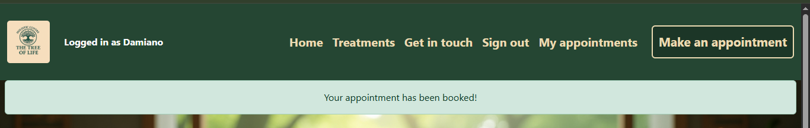
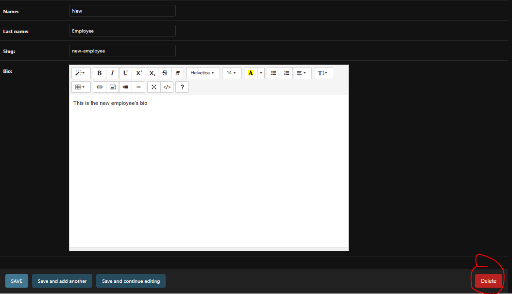
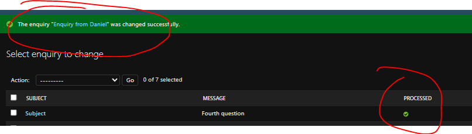

<h1 style="color: gold">Holistic centre - The tree of life</h1>

Welcome to the official website of the Holistic centre "The tree of life". Get to see the faces and to learn more about the treatments of this wellness centre, located in the very pittoresque town of Kromme-ellebogenstad (Dutch for "Crooked-elbows town"). The website is designed:

<ul>
<li>for the business owner, serving the purpose of enabling the appointment booking process and making it as straightforward as possible;</li>
<li>the visitor and the prospective customers, enabling them to see the faces of the centre and getting them acquainted with the business offer;</li>
<li>the customers, enabling them to manage their appointments;</li>
<li>the website administrator, allowing them to manage the content of the website.</li>
</ul>

<h2 style="color: darkorange">User stories</h2>
<ul>
<li><a href="#appointments"><strong style="color: darkgreen">Appointments full CRUD functionalities:</strong></a> Create (making an appointment => Appointment making form), Read (viewing list of appointments), Update (modifying appointments) and Delete (cancelling appointments)
<ol>
<li>As the business owner, I want a prominent "Make an appointment button" on the website, so that my prospective customers can easily make an appointment and I can increase my clientele;</li>
<li>As a Site user, I can register an account, so that I can make an appointment</li>
<li>As a logged in user, I can create, view, update, and delete my own appointments, so that I have full control over my treatment schedule and can manage my time effectively;</li>
</li>
</ol>
<li><a href="#employees"><strong style="color: darkgreen">Employees</strong></a>
<ol>
<li>As a Site admin, I can add, edit or delete the centre's employees' profiles, so that I can keep the employees list up to date;</li>
</ol>
</li>
<li><a href="#treatments"><strong style="color: darkgreen">Treatments</strong></a>
<ol>
<li>As a Site admin, I can add, inspect, delete or edit treatments from the list, so that I can manage the website content</li>
<li>As a customer, I can view the list of treatments with their price, so that I can choose the one that's most suitable to me within my buget;</li>
</ol>
</li>
<li><a href="#git"><strong style="color: darkgreen">Getting in touch with the holistic centre</strong></a>
<ol>
<li>As a Prospective customer, I can get in touch with the holistic centre, so that I can ask questions;</li>
<li>As a Site admin, I can store the sent in enquiries by potential customers in the database, so that I can review them;</li>
<li>As a Site admin, I can mark the sent in enquiries as "processed", so that I can see how many I still need to process</li>
</ol>
</li>
</ul>

For the implementation of these user stories, I used the following project (<a href="https://github.com/users/DR-developer98/projects/7/views/1" target="_blank">Holistic centre "The tree of life" User stories</a>) as a backlog.

<h2 style="color: darkorange">Wireframes</h2>

 

Link to repository: <a href="https://github.com/DR-developer98/Holistic-Centre-The-tree-of-life---4th-CI-Portfolio-Project" target="_blank">Holistic-Centre-The-tree-of-life---4th-CI-Portfolio-Project
</a>

Link to deployed project: <a href="https://the-tree-of-life-ol-centre-ac3c31ef4891.herokuapp.com/" target="_blank">Holistic centre "The tree of life"</a>

<h2 style="color: darkorange">ERD</h2>
<h3>Complete Entity Relationship Diagram</h3>

<h3>Relationships</h3>

<h2 style="color: darkorange">Features/Implementation of user stories</h2>
<h3 id="appointments" style="color: darkgreen">1. Appointments full CRUD functionalities:</h3>
For the following user stories, in appointments>models.py I created this custom model:

I registered it in the admin panel:

I created the form:

And finally, created the relevant views:

APPOINTMENT MAKING

APPOINTMENTS LIST DISPLAY

APPOINTMENT DETAILS MODIFICATION

APPOINTMENT CANCELLATION

<h4 style="color: gold">As the business owner, I want a prominent "Make an appointment button" on the website, so that my prospective customers can easily make an appointment and I can increase my clientele;</h4>

<strong>Acceptance criteria<strong>

<ul>
<li style="color: yellow">Acceptance criterion 1: <em>The button should be clearly visible on the page;</em>
In the navigation bar, there is a prominent "Make an appointment" button.</li>

<li style="color: yellow">Acceptance criterion 2: <em>The logged in customer should be presented with a short and intuitive form;</em></li>
 
Upon clicking on the button, there can be two different scenarios:
If the user is not logged in, they will automatically be prompted to log in (if they already have an account) or to register (if they don't).

If the user is logged in, they will presented with a short form, comprising three fields:
1. Treatment
2. Date
3. Time

Treatment selection

Date selection

Time selection 

<li style="color: yellow">Acceptance criterion 3: <em>The customer should receive immediate feedback of succesful booking;</em></li> 

After filling out the form and clicking on "Submit", the Browser will rerender the Appointment making page and show the success message "You're appointment has been booked!" above the page main header. The feedback message which will disappear after a few seconds.

In the case of the user selecting a date and time that have already been booked for that specific treatment by someone else, the Browser will show the error message "This time slot has already been taken. Please select another one".

</ul>

<h4 style="color: gold">As a Site user, I can register an account, so that I can make an appointment</h4>

<strong>Acceptance criteria<strong>

<ul>
<li style="color: yellow">Acceptance criterion 1: <em>Given an username and a password, a user can register an account;</em></li> 
By clicking on the navlink "Sign up", the user gets forwarded to a Sign up page, where they can create an account by entering a username and a password. 
 

<li style="color: yellow">Acceptance criterion 2: <em>Then the user can log in</em></li> 
After having confirmed the password, by clicking on "Sign up", the user automatically logs in, lands on the home page and is provided feedback of succesful registration.

<li style="color: yellow">Acceptance criterion 3: <em>When the user is logged in, they can make an appointment</em></li> 
When the user is logged in, they can navigate to the make an appointment page and fill out the form to book a treatment.

</ul>

<h4 style="color: gold">As a logged in user, I can create, view, update, and delete my own appointments, so that I have full control over my treatment schedule and can manage my time effectively;</h4>

<strong>Acceptance criteria<strong>

<ul>
<li style="color: yellow">Acceptance criterion 1: <em>The logged in user should be able to make an appointment by filling out a simple form;</em></li>
Please see above section.
<li style="color: yellow">Acceptance criterion 2: <em>The logged in user should have access to a list of the past and upcoming appointments, ordered in a chronologically fashion;</em></li>
When the user is logged in, the navlink "My appointments" becomes visible. By clicking on it, the user is redirected to a page, with the heading "My appointments" and a list of appointments in chronological order.

<li style="color: yellow">Acceptance criterion 3: <em>The logged in user should be able to cancel an appointment;</em></li>
<li style="color: yellow">Acceptance criterion 4: <em>The logged in user should receive a confirmation prompt to avoid accidental cancellations;</em></li>
In each appointment card, below the details, two buttons can be found: "Cancel appointment" and "Modify appointment".
By clicking on the cancel appointment button, a modal is triggered. In order to complete the cancellation, the user is required to click on the modal button "Cancel appointment". 

After the cancellation, the user is provided feedback of the succesful deletion of the appointment item.

<li style="color: yellow">Acceptance criterion 5: <em>The logged in user should be able to edit the details of the appointment (treatment, date and time);</em></li>
By clicking on the "Modify appointment" button instead, the user is redirected to an "Modify appointment" page, showing the exact same form found in the "Make an appointment" page. The fields have already been populated with the current appointment information.

<li style="color: yellow">Acceptance criterion 6: <em>The logged in user should receive a confirmation message of succesful update of the appointment details.</em></li>
After clicking on "Update appointment", the user is redirected to "My appointments", showing the appointment item with the new information.

</ul>

<h3 id="employees" style="color: darkorange">2. Employees</h3>
<h4 style="color: gold">As a Site admin, I can add, edit or delete the centre's employees' profiles, so that I can keep the employees list up to date;</h4>
For this user story, in home>models.py, I created the following Employee custom model:

I registered it in the admin panel

<strong>Acceptance criteria<strong>

<ul>
<li style="color: yellow">Acceptance criterion 1: <em>when logged in as the admin, I can create an employee profile;</em></li>

<li style="color: yellow">Acceptance criterion 2: <em>when logged in as the admin, I can view an employee profile;</em></li>
By clicking on the name of the employee, as an admin, one can view the current employee's information.

<li style="color: yellow">Acceptance criterion 3: <em>when logged in as the admin, I can edit an employee profile;</em></li>
Now it's possible to edit the name, last name, the slug and the description. 

By clicking on "Save", the admin is redirected to the employees list and can now see that "Vromme" has changed to "Eline" as well as that the slug has changed.

<li style="color: yellow">Acceptance criterion 4: <em>when logged in as the admin, I can delete an employee profile</em></li>
When selecting an employee, in the information edit screen that appears, one can delete an item by clicking on "Delete" in the lower right corner.

</ul>

<h3 id="treatments" style="color: darkorange">3. Treatments</h3>

<h4 style="color: gold">As a Site admin, I can add, inspect, delete or edit treatments from the list, so that I can manage the website content</h4>
For this user story, in treatments>models.py, I created the following custom model:

I registered it in the corresponding admin.py file:

<strong>Acceptance criteria<strong>

<ul>
<li style="color: yellow">Acceptance criterion 1: <em>when logged in as the admin, I can create a treatment item;</em></li>
In the admin panel, there is a section dedicated to the "Treatments" app. By clicking on "Add", one is forwarded to a form, that can be fill out with picture, name, slug, description, duration, duration, price and practitioner.

<li style="color: yellow">Acceptance criterion 2: <em>when logged in as the admin, I can inspect a treatment item;</em></li>
By clicking on one of the treatment items on the list, one can view the current information.

<li style="color: yellow">Acceptance criterion 3: <em>when logged in as the admin, I can edit a treatment item;</em></li>

<li style="color: yellow">Acceptance criterion 4: <em>when logged in as the admin, I can delete a treatment item.</em></li>

</ul>

<h4 style="color: gold">As a customer, I can view the list of treatments with their price, so that I can choose the one that's most suitable to me within my buget;</h4>

<strong>Acceptance criteria<strong>

<ul>
<li style="color: yellow">Acceptance criterion 1: <em>The list should clearly display the name of the treatment with its price;</em></li>
<li style="color: yellow">Acceptance criterion 2: <em>The list should be up-to-date with the current business offer</em></li>
In the navbar, the visitor (who does not need to be logged in) can access the "Treatments" page, by clicking on the Treatments navlink. 
This section of the website displays a list of cards, one for each treatment item. Within the card, one can see name, description, duration, price and an indicative image.

<h3 style="color: darkorange">4. Getting in touch with the holistic centre</h3>
For the next user stories, in get_in_touch>models.py I created the following custom model:

I registered the model in the admin panel:

I created the relevant form:

And designed the relevant view:

<h4 id="git" style="color: gold">As a Prospective customer, I can get in touch with the holistic centre, so that I can ask questions</h4>

<strong>Acceptance criteria<strong>

<ul>
<li style="color: yellow">Acceptance criterion 1: <em>The website should comprise a "Get in touch" page;</em></li>
In the navigation bar, I included a "Get in touch" link. When clicked, it redirects the user to a Contact page.

<li style="color: yellow">Acceptance criterion 2: <em>There should be a list with several ways to get in touch with the centre;</em></li>
Below the hero-image, the user is presented with a list of several ways to get in touch with the center, namely an email, phone number, the physical address of the holistic centre. Further at the bottom of the page, this section comprises a contact form.

<li style="color: yellow">Acceptance criterion 3: <em>There should be a form that I can fill out for longer/more detailed enquiries.</em></li>
Please refer to the screenshot above.
<li style="color: yellow">Acceptance criterion 4: <em>I should receive a clear feedback message upon succesfully submitting the form;</em></li>
The form has to be filled out in its entirety. Failing to do so, will result in being prompted to fill in the empty field.

After submitting, the contact page will be rerendered and show a success message above the "Contact" heading.

</ul>

<h4 style="color: gold">As a Site admin, I can store the sent in enquiries in the database, so that I can review them</h4>

<strong>Acceptance criteria<strong>

<ul>
<li style="color: yellow">Acceptance criterion 1: <em>In the admin-panel there should be a section dedicated to the submitted enquiries</em></li>
In the admin panel, there is a section dedicated to Enquiries.

In the overview, as an admin you get a preview of the message. By clicking on one of the enquiries, one can get access to the whole content.

</ul>

<h4 style="color: gold">As a Site admin, I can mark the sent in enquiries as "processed", so that I can see how many I still need to process</h4>

<strong>Acceptance criteria<strong>

<ul>
<li style="color: yellow">Acceptance criterion 1: <em>When logged in as a site admin, I should be able to tick "processed" for an answered enquiry;</em></li>
When reviewing an enquiry item, by checking "processed" and clicking on "Save", the enquiry will be displayed on the list with a green check sign.

<li style="color: yellow">Acceptance criterion 2: <em>I should be able to filter the received requests based on their "processed"/"unprocessed" status.</em></li>
The enquiries list panel comprises a side panel, which enables the admin to filter the enquiry items based on their processed/unprocessed status.

By clicking on "Yes", one can only show the processed enquiries. By clicking on "No", only the yet to be processed enquiry items will be shown.

</ul>

<h3 style="color: darkorange">Other features</h3>
<h4 style="color: gold">Footer</h4>

The footer as well as the navigatio bar comprises the logo of the website. The logo, when clicked, redirects the user to the homepage. 
Further, the footer comprises on the left: the (fictious) physical address of the holistic centre and the copyright information; on the right: the (ficticious) phone number and email and the social media icons. These icons currently link to the sign up/in page of the respective social networks.

<h4 style="color: gold">Home page --> Our team section</h4>

In the home page, below the hero-image and the main heading, an "Our team"-section can be found. This comprises the photos and names of the four employees. I took inspiration for this feature from this website: <a href="https://wellnessaandezaan.nl/" target="_blank">Wellness aan de Zaan</a>

<h3>Future implementations</h3>

In the future, the following features can be added to this application:

<ul>
<li>The social media icons in the footer should redirect the user to the actual social media profiles of this holistic centre;</li>
<li>An "About us" page, with some background information about each employee; this app can be furthered enhanced by adding a "Make an appointment" button that prepopulates the appointment form with the name of the employee, in this way enabling the user to make an appointment with preferred employee;</li>
<li>In the home page under each employee, a "Get to know them" button can be added, which links to the "About us" page, so that the website visitors would be directly forwarded to the presentation/background text of the selected employee;</li>
<li>In the treatment page, a "Make an appointment" button could be added for each treatment, which - when clicked - would redirect the visitor to the appointment form and populate the "treatment"-field with the selected item;</li>
<li>Django logic could be added to the base template to include a "Scheduled appointment" navlink, only visible for the logged in Employee-user, similar to the current "My appointments" page, where the employee would have access to the list of appointments booked with them. This section would allow the employee to modify the appointment or to delete it. To finish it off, one could consider integrating a notification system to informt the user about the change and the reason for the change.</li>
<li>For the purpose of this project, I decided to not refine the time selection field of the appointment form. further. In future enhancements, one can definitely consider tailoring the time and date selection to the duration of the selected treatment and to the employees' schedules. This could be achieved by wiring the form to the employee's Google Calendar.</li>
</ul>

<h2 style="color: darkorange">Testing</h2>

For the testing part, including fixed bugs, please refer to <a href="TESTING.md">TESTING.md</a>

<h2 style="color: darkorange">Deployment</h2>

This project was developped on Heroku.

Once you're logged in on Heroku, go to your dashboard and from there follow the steps hereinafter.

<ol>
<li>Click on "New" --> "Create new app"</li>
<li>Choose a unique name, choose your region and press "Create app";</li>
<li>Click on "Settings" and then "Reveal Config Vars"</li>
<li>Add a key of "DISABLE_COLLECTSTATIC" with a value of '1'.</li>
<li>Add a key of "DATABASE_URL" - the value will be the URL you were emailed when creating your database.</li>
<li>Add a key of "SECRET_KEY" - the value will the secret key you created yourself or a randomly generated one (Google "Secret key generator" is a good tool to create such a random string of numbers, letters and characters")</li>
<li>In your terminal, type the code you will need to install the project requirements:
<ul>
<li>pip3 install gunicorn~=20.1</li>
<li>pip3 install -r requirements.txt</li>
<li>pip3 freeze --local > requirements.txt</li>
</ul>
</li>
<li>Create an "env.py" file at the root directory which contains the following:
<ul>
<li>import os</li>
<li>os.environ["DATABASE_URL"]="CI database URL"</li>
<li>os.environ["SECRET_KEY"]= "Your secret key"</li>
</ul>
</li>
<li>Create a file at the root directory called Procfile. In this file enter: "web: gunicorn my_project.wsgi" (without the quotes)</li>
<li>In settings.py, set DEBUG to False.</li>
It is paramount to always set DEBUG to False before deploying your project on Heroku. This is for security reasons.
<li>Add ",'.herokuapp.com' " (without the double quotes) to the ALLOWED_HOSTS list in settings.py</li>
<li>Add, commit and push your code.</li>
<li>Go back to Heroku, click on the "Deploy" tab.</li>
<li>Connect your project to GitHub.</li>
<li>Scroll to the bottom and click "Deploy Branch" and your project will be deployed.</li>
</ol>

<h2 style="color: darkorange">Credits</h2>
<h3>Content</h3>
<ul>
<li><a href="https://copilot.microsoft.com/chats/GB3BA3usiipHcgySkE9RN" target="_blank">Microsoft Copilot</a> was used for some debugging, incorporation of widgets in the make an appointment form and tweaking of some models and views. For detailed source referencing, please see code.</li>
<li>The "I think, therefore I blog" Code Institute Project was also referenced for - amongst others - the sign in, sign up and sign out html templates and for linking the cancel appointment button to the modal. The exact code sections that were built in this way are indicated in detail in the code.</li>
<li><a href="https://stackoverflow.com/" target="_blank">Stackoverflow</a> was consulted for - amongst others - building the TimeOut function for the fade out effect on Django messages. Detailed referencing can be found in the code.</li>
</ul>

<h3 style="color: gold">Used technologies and media</h3>
<ul>
<li>The names of the employees were generated by <a href="https://www.random-name-generator.com/netherlands?s=965&search_terms=&gender=female&search_terms=&n=3" target="_blank">Random Dutch names generator</a>, therefore, any reference to real people is totally unintentional;</li>
<li>The descriptions of the employees and the treatments, as well as their names, were all made using <a href="https://copilot.microsoft.com/chats/GB3BA3usiipHcgySkE9RN" target="_blank">Microsoft Copilot</a></li>
<li>The physical address, the email and phone number were all made up by me. Once again, any reference to existing places, email addresses and phone numbers are totally unintentional;</li>
<li>The website logo, the images of the employees and the treatments were created with <a href="https://copilot.microsoft.com/chats/GB3BA3usiipHcgySkE9RN" target="_blank">Microsoft Copilot</a></li>
<li>The hero-images in the home page, treatments, get in touch and make an appointment page were created using <a href="https://leonardo.ai/" target="_blank">Leonardo.AI</a></li>
<li>The ERD was created using <a href="https://dbdiagram.io/" target="_blank">dbdiagram.io</a></li>
<li><a href="https://dbs.ci-dbs.net/" target="_blank">PostgreSQL from Code Institute</a> was used to create the database;</li>
<li>Django (Python) was used for building and managing the project and its different apps;</li>
<li>HTML was used for the templates' structure;</li>
<li>Bootstrap and its classes were used for the quick design of most of the HTML elements (especially the navigation bar and the modal for the warning message upon cancelling an appointment) and their responsiveness on different devices</li>
<li>CSS was used for the styling and the buttons hover effects;</li>
<li>JavaScript was used for handling the appointment edit and cancel functions;</li>
<li>All the screenshots were taken from my own laptop.</li>
</ul>

