<h1>TESTING</h1>
I tested that this website works across some of the major Browsers: Google Chrome, Mozilla Firefox, Opera and Brave (the latter was tested on my personal mobile phone: Samsung A52). I also ran manual tests on the following devices and the website worked on all of them as expected.

<ul>
<li><strong>Mobile phone:</strong> Samsung A52</li>
<li><strong>Tablet:</strong> Galaxy Tab A (2016);</li>
<li><strong>Laptop:</strong> Lenovo.</li>
</ul>
For responsiveness and tests on devices larger than the ones mentioned above I used the BrowserDev Tools.

<h2 style="color: darkorange">Validator testing</h2>

<h3>HTML Validator</h3>

<strong>Home page</strong>

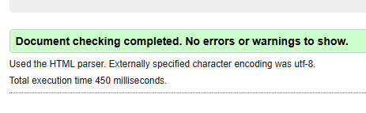

<strong>Treatments</strong>

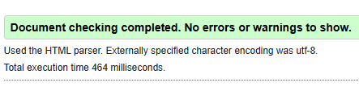

<strong>Get in touch</strong>

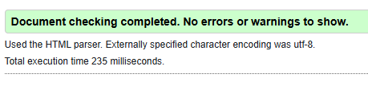

<strong>My appointments</strong>

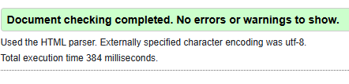

<strong>Make appointment</strong>

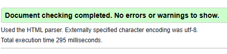

<strong>Sign out</strong>

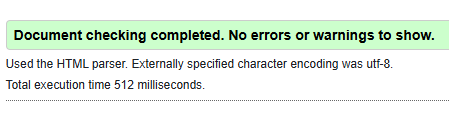

<strong>Sign in</strong>

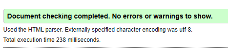

<h3>CSS Validator</h3>
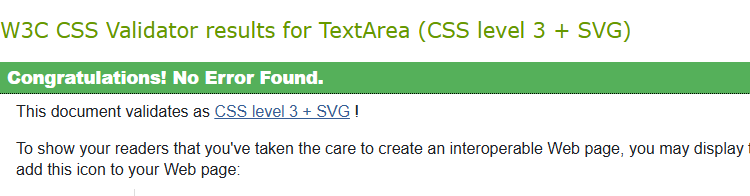

<h3>JS Hint Validator</h3>
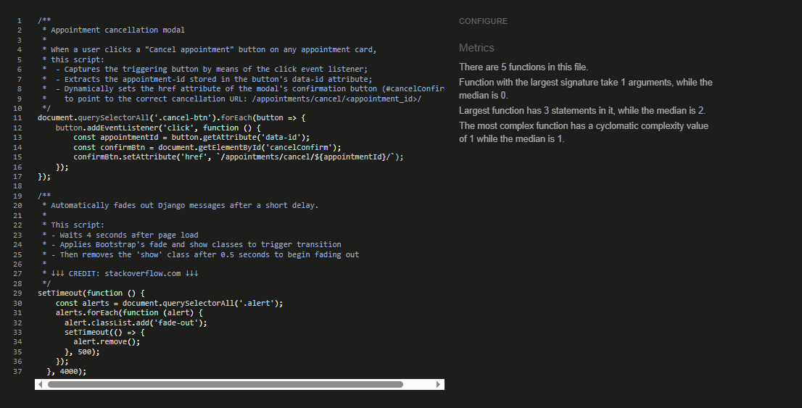

<h3>CI Python Linter</h3>

I passed all python code through the linter and no errors were returned. Here below an example (get-in-touch>views.py)

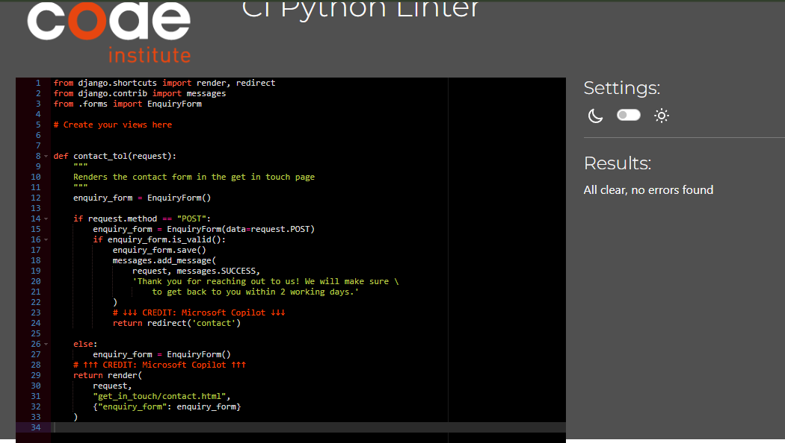

<h3>Lighthouse report</h3>

<h2>Manual Testing</h2>
<table>
<tr>
<th style="color: gold">Action</th>
<th style="color: gold">Expected behaviour</th>
<th style="color: gold">Pass/Fail</th>
<tr>
<tr>
<td><strong style="color: gold">START PAGE</strong></td>
<td>-</td>
<td>-</td>
</tr>
<tr>
<td></td>
<td></td>
<td></td>
</tr>
<tr>
<td></td>
<td></td>
<td></td>
</tr>
<tr>
<td></td>
<td></td>
<td></td>
</tr>
<tr>
<td></td>
<td></td>
<td></td>
</tr>
<tr>
<td></td>
<td></td>
<td></td>
</tr>
<tr>
<td></td>
<td></td>
<td></td>
</tr>
<tr>
<td></td>
<td></td>
<td></td>
</tr>
<tr>
<td></td>
<td></td>
<td></td>
</tr>
<tr>
<td></td>
<td></td>
<td></td>
</tr>
<tr>
<td></td>
<td></td>
<td></td>
</tr>
<tr>
<td></td>
<td></td>
<td></td>
</tr>
<tr>
<td></td>
<td></td>
<td></td>
</tr>
<tr>
<td></td>
<td></td>
<td></td>
</tr>
<tr>
<td></td>
<td></td>
<td></td>
</tr>
<tr>
<td></td>
<td></td>
<td></td>
</tr>
<tr>
<td></td>
<td></td>
<td></td>
</tr>
<tr>
<td></td>
<td></td>
<td></td>
</tr>
<tr>
<td></td>
<td></td>
<td></td>
</tr>
<tr>
<td></td>
<td></td>
<td></td>
</tr>
<tr>
<td></td>
<td></td>
<td></td>
</tr>
<tr>
<td></td>
<td></td>
<td></td>
</tr>
<tr>
<td></td>
<td></td>
<td></td>
</tr>
<tr>
<td></td>
<td></td>
<td></td>
</tr>
<tr>
<td></td>
<td></td>
<td></td>
</tr>
<tr>
<td></td>
<td></td>
<td></td>
</tr>
<tr>
<td></td>
<td></td>
<td></td>
</tr>
<tr>
<td></td>
<td></td>
<td></td>
</tr>
<tr>
<td></td>
<td></td>
<td></td>
</tr>
<tr>
<td></td>
<td></td>
<td></td>
</tr>
<tr>
<td></td>
<td></td>
<td></td>
</tr>
<tr>
<td></td>
<td></td>
<td></td>
</tr>
<tr>
<td></td>
<td></td>
<td></td>
</tr>
<tr>
<td></td>
<td></td>
<td></td>
</tr>
<tr>
<td></td>
<td></td>
<td></td>
</tr>
<tr>
<td></td>
<td></td>
<td></td>
</tr>
<tr>
<td></td>
<td></td>
<td></td>
</tr>
<tr>
<td></td>
<td></td>
<td></td>
</tr>
<tr>
<td></td>
<td></td>
<td></td>
</tr>
<tr>
<td></td>
<td></td>
<td></td>
</tr>
<tr>
<td></td>
<td></td>
<td></td>
</tr>
<tr>
<td></td>
<td></td>
<td></td>
</tr>
<tr>
<td></td>
<td></td>
<td></td>
</tr>
<tr>
<td></td>
<td></td>
<td></td>
</tr>
<tr>
<td></td>
<td></td>
<td></td>
</tr>
<tr>
<td></td>
<td></td>
<td></td>
</tr>
</table>

<h2 style="color: darkorange">Fixed bugs</h2>

<ul>
<li>When building the landing page for the website, although I had populated the website with the employees by means of a fixture, the employees weren't showing up on the page. This was due to the fact that I had changed the name of the app, but forgot to adapt the model name in the JSON-object. This was fixed by setting the value of "model" to "home.employee".</li>

<li>When designing the get in touch form, after applying the crispy forms filter, I was getting an error stating that the filter "cripsy" wasn't recognized. This was caused by the the name of the form and the "crispy" filter being written with an extra space inbetween. This was simply fixed by removing the exta space the form, the crispy filter and the pipe.</li>

<li>The confirmation messages upon signing in, up and out weren't being displayed in the home page. This was caused by me having forgotten to display the messages block in the index.html template. This was simply solved by adding this block into the relevant template.</li>

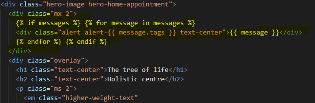

<li>The Django messages weren't fading out on all relevant templates; this was caused by the {} containing the link to script.js being absent in those templates. This was simply solved by adding the abovementioned block.</li>

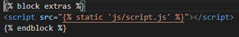
</ul>
