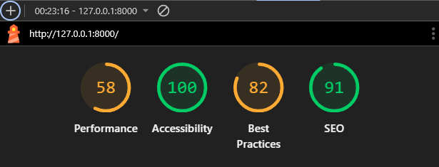

<h1>TESTING</h1>
I tested that this website works across some of the major Browsers: Google Chrome, Mozilla Firefox, Opera and Brave (the latter was tested on my personal mobile phone: Samsung A52). I also ran manual tests on the following devices and the website worked on all of them as expected.

<ul>
<li><strong>Mobile phone:</strong> Samsung A52</li>
<li><strong>Tablet:</strong> Galaxy Tab A (2016);</li>
<li><strong>Laptop:</strong> Lenovo.</li>
</ul>
For responsiveness and tests on devices larger than the ones mentioned above I used the BrowserDev Tools.

<h2 style="color: darkorange">Validator testing</h2>

<h3>HTML Validator</h3>

<strong>Home page</strong>

<strong>Treatments</strong>

<strong>Get in touch</strong>

<strong>My appointments</strong>

<strong>Make appointment</strong>

<strong>Sign out</strong>

<strong>Sign in</strong>

<h3>CSS Validator</h3>

<h3>JS Hint Validator</h3>

<h3>CI Python Linter</h3>

I passed all python code through the linter and no errors were returned. Here below an example (get-in-touch>views.py)

<h3>Lighthouse report</h3>

<h2>Manual Testing</h2>
<table>
<tr>
<th style="color: gold">Action</th>
<th style="color: gold">Expected behaviour</th>
<th style="color: gold">Pass/Fail</th>
<tr>
<tr>
<td><strong style="color: gold">HOME PAGE</strong></td>
<td>-</td>
<td>-</td>
</tr>
<tr>
<td>Go to https://the-tree-of-life-ol-centre-ac3c31ef4891.herokuapp.com/</td>
<td>Land on homepage, Home navlink is black (.active)</td>
<td>Pass</td>
</tr>
<tr>
<td>From the homepage, click on Home</td>
<td>Rerender the page, land on homepage</td>
<td>Pass</td>
</tr>
<tr>
<td>From the homepage, click on the logo in the navbar</td>
<td>Rerender the page, land on homapage</td>
<td>Pass</td>
</tr>
<tr>
<td>From the homepage, click on the logo in the footer</td>
<td>Rerender the page, land on homepage</td>
<td>Pass</td>
</tr>
<tr>
<td>Click on "Treatments"</td>
<td>Land on Treatments page, /treatments/ is added to the URL<; "Treatments" navlink is black (.active)</td>
<td>Pass</td>
</tr>
<tr>
<td>Click on "Get in touch"</td>
<td>Land on Contact page, /contact/ is added to the URL; "Get in touch" navlink is black (.active)</td>
<td>Pass</td>
</tr>
<tr>
<td>You're logged out</td>
<td>The navlink includes the following navlinks: "Home", "Treatments", "Get in touch", "Sign up", "Sign in", "Make an appointment"</td>
<td>Pass</td>
</tr>
<tr>
<td>While logged out, click on "Make an appointment"</td>
<td>Be redirected to the "Sign in" page; you're prompted to enter your username and password or to sign up; "Sign in" navlink is black (.active)</td>
<td>Pass</td>
</tr>
<tr>
<td>Enter the correct credentials in the Sign in page (from "Make an appointment")</td>
<td>Render "Make an appointment", feedback message "Succesfully logged in as <username>" is shown, "Make an appointment" button in navbar is active. The text "Logged in as <username>" is visible next to the logo in the navbar.</td>
<td>Pass</td>
</tr>
<tr>
<td>Click on "Sign out"</td>
<td>Be asked to confirm if you want to sign out</td>
<td>Pass</td>
</tr>
<tr>
<td>In the Sign out page, click on Sign out</td>
<td>Be redirected to homepage, feedback message appears under the navbar "You have succesfully signed out".
The navbar now includes the following navlinks: "Home", "Treatments", "Get in touch", "Sign up", "Sign in", "Make an appointment". The text "Logged in as <username>" next to the logo has disappeared. The confirmation message "You have signed out" appears under the navbar and disappears after a couple of seconds.</td>
<td>Pass</td>
</tr>
<tr>
<td>While logged out, click on "Sign up"</td>
<td>"Sign up" navlink becomes black (.active). User is asked to enter a Username, an email (optional), a password and to confirm the chosen password.</td>
<td>Pass</td>
</tr>
<tr>
<td>In the Sign up page, after having entered all the necessary credentials, click on "Sign up"</td>
<td>Get forwarded to home page, feedback message "Succesfully logged in as <username>" appears under navbar and disappears after a couple of seconds. The text "Logged in as <username> has now appeared next to the logo in the navbar. The navbar now includes the navlinks "Sign out" and "My appointments" instead of "Sign up" and "Sign in".</td>
<td>Pass</td>
</tr>
<tr>
<td>From any other page but the home page, click on the Logo in either the navbar or in the footer</td>
<td>Be forwarded to the homepage</td>
<td>Pass</td>
</tr>
<tr>
<td>APPOINTMENTS</td>
<td>-</td>
<td>-</td>
</tr>
<tr>
<td>While logged in, with no appointments scheduled, click on "My appointments"</td>
<td>Navlink "My appointments" becomes black (.active). Under the heading "My appointments", the text "You currently have no appointed planned". /appointments/list/ is added to the base URL.</td>
<td>Pass</td>
</tr>
<tr>
<td>While logged in, with scheduled appointments, click on "My appointments"</td>
<td>"My appointments" page displays as many cards as there are scheduled appointments. The cards show: treatment name, practitioner, duration, price, date and time. On the bottom of the card there are two buttons: "Cancel appointment" and "Modify your appointment".</td>
<td>Pass</td>
</tr>
<tr>
<td>Click on Cancel Appointment</td>
<td>A modal is triggered open on top of the page, with the text "Cancel appointment? Are you sure you want to cancel this appointment? This action cannot be undone.". At the bottom there are two buttons: "Close" and "Cancel appointment".</td>
<td>Pass</td>
</tr>
<tr>
<td>Click on Close (modal)</td>
<td>The modal closes/disappears</td>
<td>Pass</td>
</tr>
<tr>
<td>Click on "Cancel appointment"</td>
<td>The browser rerenders the "My appoitment" page, a confirmation message is shown below the heading "My appointments": "Appointment cancelled succesfully!". The message disappear after a couple of seconds. The cancelled appointment has been removed fromt the list.</td>
<td>Pass</td>
</tr>
<tr>
<td>Click on "Modify appointment"</td>
<td>/edit/<id>/ is added to the base URL. The user is redirected to the "Modify your appointment" page. Below the main heading, the user is presented with the same make an appointment form. The form is prepopulated with the current appointment information.</td>
<td>Pass</td>
</tr>
<tr>
<td>Change information to something valid (no already taken time slot) and click on "Update appointment"</td>
<td>The user is redirected to "My appointments" page, the confirmation message "Appointment updated succesfully" appears under the heading "My appointments". The appointment card with the new information is visible on the list.</td>
<td>Pass</td>
</tr>
<tr>
<td>Change information to something not valid (already taken time slot) and click on "Update appointment"</td>
<td>The browser stays in the "Modify appointment" page and the following message is shown below the main heading: "This time slot is already taken. Please choose another."</td>
<td>Pass</td>
</tr>
<tr>
<td>Click on "Make an appointment", fill out the form (no already taken time slots) and click on "Submit"</td>
<td>Browser rerenders the "Make an appointment" page and the confirmation message "Your appointment has been booked!" is shown below the navbar. The new appointment has been added to the list in "My appointments" in the correct order.</td>
<td>Pass</td>
</tr>
<tr>
<td>In "Make an appointment", fill out the form (choose an already taken time slot for a certain treatment") and click on "Submit"</td>
<td>The browser rerenders the "Make an appointment" page. The error message "This time slot is already taken. Please choose another." appears below the navbar.</td>
<td>Pass</td>
</tr>
<tr>
<td>GET IN TOUCH</td>
<td>-</td>
<td>-</td>
</tr>
<tr>
<td>From any page, click on "Get in touch"</td>
<td>/contact/ is added to the base URL. The user is presented with a list of ways to get in touch with the holistic centre and with a contact form (Name, Subject, Email, Message).</td>
<td>Pass</td>
</tr>
<tr>
<td>Fill out the form partially</td>
<td>Get prompted to fill out the missing fields (one at a time if more than one have been left empty)</td>
<td>Pass</td>
</tr>
<tr>
<td>Fill out the form completely and click on "Submit"</td>
<td>Browser rerenders the Contact page. The following message "Thank you for reaching out to us! We will make sure to get back to you within 2 working days." pops up below the navigation bar.</td>
<td>Pass</td>
</tr>
<tr>
<td>FOOTER</td>
<td>-</td>
<td>-</td>
</tr>
<tr>
<td>Click on the Instagram icon</td>
<td>Opens Instagram sign up page in a new tab</td>
<td>Pass</td>
</tr>
<tr>
<td>Click on the LinkedIn icon</td>
<td>Opens LinkedIn sign up page in a new tab</td>
<td>Pass</td>
</tr>
<tr>
<td>Click on the Facebook icon</td>
<td>Opens Facebook sign up page in a new tab</td>
<td>Pass</td>
</tr>

</table>

<h2 style="color: darkorange">Fixed bugs</h2>

<ul>
<li>When building the landing page for the website, although I had populated the website with the employees by means of a fixture, the employees weren't showing up on the page. This was due to the fact that I had changed the name of the app, but forgot to adapt the model name in the JSON-object. This was fixed by setting the value of "model" to "home.employee".</li>

<li>When designing the get in touch form, after applying the crispy forms filter, I was getting an error stating that the filter "cripsy" wasn't recognized. This was caused by the the name of the form and the "crispy" filter being written with an extra space inbetween. This was simply fixed by removing the exta space the form, the crispy filter and the pipe.</li>

<li>The confirmation messages upon signing in, up and out weren't being displayed in the home page. This was caused by me having forgotten to display the messages block in the index.html template. This was simply solved by adding this block into the relevant template.</li>

<li>The Django messages weren't fading out on all relevant templates; this was caused by the {} containing the link to script.js being absent in those templates. This was simply solved by adding the abovementioned block.</li>

</ul>
