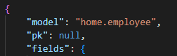
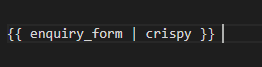

<h3 style="color: darkorange">Fixed bugs</h3>

<ul>
<li>When building the landing page for the website, although I had populated the website with the employees by means of a fixture, the employees weren't showing up on the page. This was due to the fact that I had changed the name of the app, but forgot to adapt the model name in the JSON-object. This was fixed by setting the value of "model" to "home.employee".</li>

<li>When designing the get in touch form, after applying the crispy forms filter, I was getting an error stating that the filter "cripsy" wasn't recognized. This was caused by the the name of the form and the "crispy" filter being written with an extra space inbetween. This was simply fixed by removing the exta space the form, the crispy filter and the pipe.</li>

</ul>

<h2 style="color: darkorange">Credits</h2>